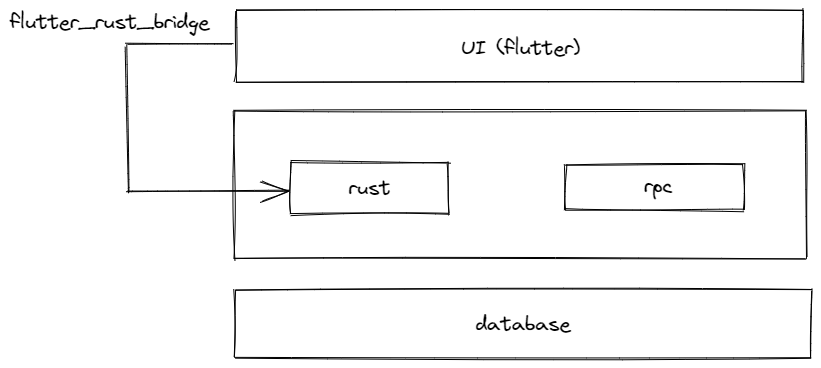

# knowledge_one

这是一个练手项目，主要使用 flutter + rust （+ gRPC）

flutter 版本是3.3.7

数据库mysql,创建数据库sql可以[参考](./knowledge_one.sql)

## changelogs

* 0.0.2 [details](./changelogs/0_0_2.md)
* 0.0.1 [details](./changelogs/0_0_1.md)
