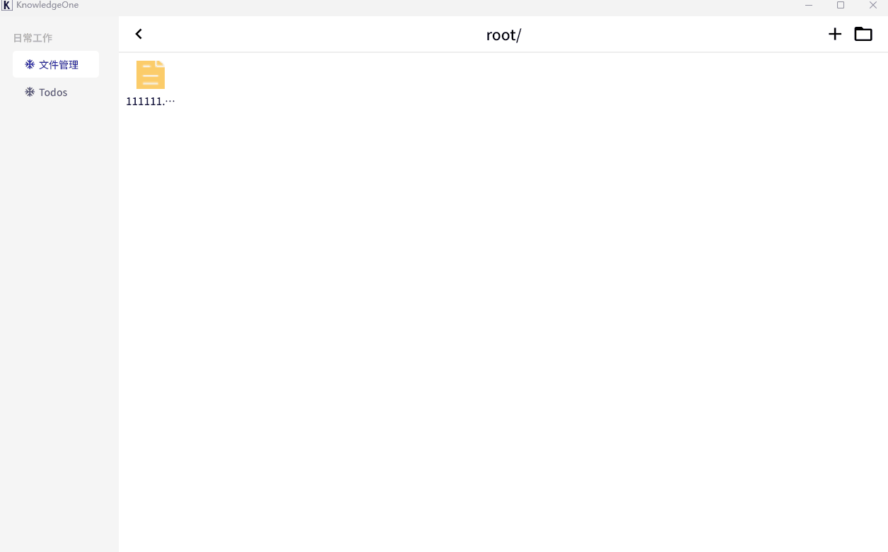
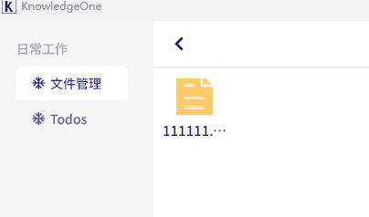

* 文件管理右键添加使用系统软件打开的功能,不过比较囧的是只支持英文路径([issue 98740](https://github.com/flutter/flutter/issues/98740))
* file_changelog模块是一个仿 svn 的版本控制方案，不过是针对二进制的。因为rust实现起来有点困难（主要是我的想法在rust上实现效率不如numpy那么快），所以还是使用python的rpc实现了。具体看[file_changelog.py](../rpc/file_changelog/file_changelog.py)

## 完成的功能

## 修复的bug

| before | now  |
| ------ | ---- |
|        |      |

