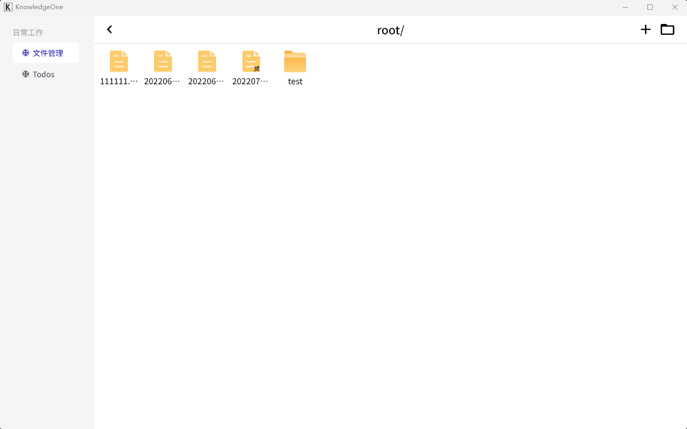
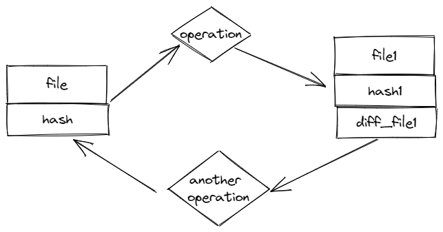

## 修复的bug

* 文件夹结构错误问题
* 文件列表"抖动"问题([110957](https://github.com/flutter/flutter/issues/110957))
* changelog功能完善（尽量不要使用大文件，否则效率很慢，这个版本还没有同步数据库，只是把restore文件保存下来）
  > 

  changelog原理：
  
  

  > 对任意二进制文件操作之后，留下`diff_file`作为文件回溯的依据

* 修改了`rpc`打包方式，因为`pyinstaller` -F 打包会有两个进程，后台管理的时候杀不死。[2483](https://github.com/pyinstaller/pyinstaller/issues/2483)
* 添加了关闭app的监听，同时关掉rpc进程